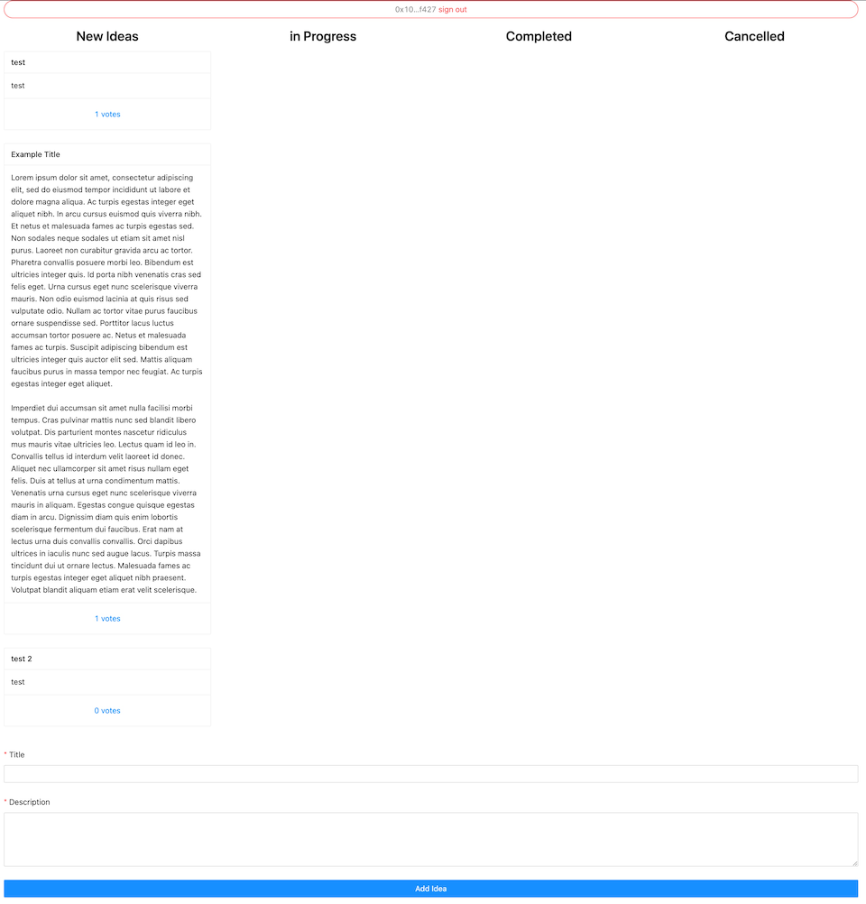

# Summary

In the upcoming months some blog entries will be written with sample projects. To widen the pool of ideas, everyone is welcome to submit ideas. Everyone can vote with their wallet to increase priority for certain ideas.

This tutorial leads thru that initial project which will be a kanban board with the following features:

1. Ideas can be created by everyone with:
   1. Title
   1. Description
1. Everyone can upvote an idea to increase the priority
1. Ideas are grouped in a Kanban style board with the following columns for progress tracking:
   1. Idea
   1. In Progress
   1. Done
   1. Cancelled
   1. … only an admin can change the state
1. No spam or abuse protection in the MVP

## Structure

### Data storage on the Blockchain

An Idea will be a standard NFT Token with the following attributes:

1. `(Text)` Title
1. `(Text)` Description
1. `(Address)` Owner = creator of the idea
1. `(uint)` Upvotes
1. `(address[])` List of Upvoters
1. `(uint)` Status / Progress / Column

### Interface

A react web application with standard antd components:

1. Columns for each status
1. List of Ideas within each column
   1. sorted by upvotes
   1. ability to see details (Title, Description, Creator, Upvotes)
1. Connect Wallet ability, if connected:
   1. see own upvote status
   1. and ability to upvote ideas (once)
   1. ability to create add new ideas
   1. (if admin) ability to change status of an idea

# Project Setup

Initialize project with an empty react project to have a directory structure:

```shell
yarn create react-app kanban
cd kanban
```

## React

Setting up the project is a bit of a hassle because react hides some configuration values required to run. [react-app-rewired](https://github.com/timarney/react-app-rewired) helps out:

```shell
yarn add react-app-rewired
yarn add --dev assert buffer crypto-browserify stream-http https-browserify os-browserify process stream-browserify util stream
```

patch `package.json` according to instructions:

```diff
  /* package.json */

  "scripts": {
-   "start": "react-scripts start",
+   "start": "react-app-rewired start",
-   "build": "react-scripts build",
+   "build": "react-app-rewired build",
-   "test": "react-scripts test",
+   "test": "react-app-rewired test",
    "eject": "react-scripts eject"
}
```

and create a custom `config-overrides.js` to provide all required dependencies:

```js
const webpack = require('webpack')

module.exports = function override (config, env) {
  config.ignoreWarnings = [/Failed to parse source map/]
  config.resolve.fallback = {
    url: require.resolve('url'),
    assert: require.resolve('assert'),
    crypto: require.resolve('crypto-browserify'),
    http: require.resolve('stream-http'),
    https: require.resolve('https-browserify'),
    os: require.resolve('os-browserify/browser'),
    buffer: require.resolve('buffer'),
    stream: require.resolve('stream-browserify')
  }

  config.plugins.push(
    new webpack.ProvidePlugin({
      process: 'process/browser',
      Buffer: ['buffer', 'Buffer']
    })
  )

  return config
}
```


## Hardhat

```shell
yarn add --dev hardhat @nomiclabs/hardhat-waffle @nomiclabs/hardhat-ethers @vechain.energy/hardhat-thor @openzeppelin/contracts hardhat-jest-plugin nodemon
npx hardhat

✔ What do you want to do? · Create an empty hardhat.config.js
✨ Config file created ✨
```

configure vechain and plugins in `hardhat.config.js`:

```js
require("@nomiclabs/hardhat-waffle");
require('@vechain.energy/hardhat-thor')
require("hardhat-jest-plugin")

module.exports = {
 solidity: "0.8.4",
 networks: {
    vechain: {
      url: 'https://testnet.veblocks.net',
      privateKey: "0x80b97e2ecfab8b1c78100c418328e8a88624e3d19928ec791a8a51cdcf01f16f",
      delegateUrl: 'https://sponsor-testnet.vechain.energy/by/90',
      blockGasLimit: 10000000
    }
  }
};
```

Init jest tests:

```shell
$ npx jest --init  

The following questions will help Jest to create a suitable configuration for your project

✔ Would you like to use Jest when running "test" script in "package.json"? … no
✔ Would you like to use Typescript for the configuration file? … no
✔ Choose the test environment that will be used for testing › node
✔ Do you want Jest to add coverage reports? … no
✔ Which provider should be used to instrument code for coverage? › v8
✔ Automatically clear mock calls, instances and results before every test? … yes

📝  Configuration file created at ./jest.config.js

```

Delete reacts example test to not get mixed up with contract tests:

```shell
$ rm src/App.test.js
```

To execute hardhat tests easily, a new script `contract:test` and `contract:test:watch` is added to `package.json`:

```diff
  "scripts": {
    "start": "react-app-rewired start",
    "build": "react-app-rewired build",
    "test": "react-app-rewired test",
    "eject": "react-app-rewired eject",
+    "contract:test": "hardhat test:jest",
+    "contract:test:watch": "nodemon -e sol --exec 'hardhat test:jest --watch'"
  },
```


# Data Storage / Contract

To keep it as simple as possible, OpenZeppelin will serve as source of the NFT Contract:  
https://wizard.openzeppelin.com/#erc721


The configured contract is stored in `contracts/Idea.sol`.

## Create Ideas

A public function to create an Idea is the first thing required. The requirement stats Ideas can be created by everyone with a Title and Description. Thats as simple as:

```js
function createIdea(title, description) public {}
```

### Minting Test

The initial test can just verify that the minting works by verifying that it creates token #0:

```js
describe('createIdea(title, description)', () => {
  it('mints token #0 for a new idea', async () => {
    const title = 'Test Title'
    const description = 'Test Description'

    const transaction = await contracts.idea.createIdea(title, description)
    const { events } = await transaction.wait()

    const { tokenId } = events.find(({ event }) => event === 'Transfer').args
    expect(tokenId).toEqual(BigNumber.from(0))
  })
})
```

Run `yarn contract:test:watch` in a terminal and watch what happens. It fails right now, because the contract function does not exist yet.

### Minting Logic

A simple starting point that just mints Ideas is creating a new token and not care much about the data yet:

```solidity
function createIdea(string memory title, string memory description) public {
    uint256 tokenId = _tokenIdCounter.current();
    _tokenIdCounter.increment();
    _safeMint(msg.sender, tokenId);
    _setTokenURI(tokenId, title);
}
```

Tests will be successful now:

```shell
 PASS  contracts/Ideas.test.js
  createIdea(title, description)
    ✓ mints token #0 for a new idea (311 ms)

Test Suites: 1 passed, 1 total
Tests:       1 passed, 1 total
```

### Notes

In tests creating Ideas will be used a lot, thats why a helper function that calls `createIdea` from different user perspectives and returns the new tokenId is very useful:

```js
async function createIdeaFor (user, ...args) {
  const { events } = await (await contracts.idea.connect(user).createIdea(...args)).wait()
  const { tokenId } = events.find(({ event }) => event === 'Transfer').args
  return tokenId
}
```


## Support for additonal attributes

An Idea has several attributes, this is the list:

1. `(Text)` Title
1. `(Text)` Description
1. `(Address)` Owner = creator of the idea
1. `(uint)` Upvotes
1. `(address[])` List of Upvoters
1. `(uint)` Status / Progress / Column

Attributes for a single data object can be desecribed with a data structure that is assigned to each token:

```sol
struct Attributes {
    string title;
    string description;
    uint upvotes;
    mapping(address => bool) addressVoted;
    uint status;
}

mapping(uint256 =>  Attributes) public tokenAttributes;
```

## Title & Description

Due the `public` declarataion of the `tokenAttributes` the data is already available from the outside. It can be expected like this:

```js
it('remembers title and description during minting', async () => {
  const title = 'Test Title'
  const description = 'Test Description'

  const tokenId = await createIdeaFor(user1, title, description)

  const attributes = await contracts.idea.tokenAttributes(tokenId)
  expect(attributes.title).toEqual(title)
  expect(attributes.description).toEqual(description)
})
```

And writing can be done within `createIdea`:

```sol
function createIdea(string memory title, string memory description) public {
    uint256 tokenId = _tokenIdCounter.current();
    _tokenIdCounter.increment();
    _safeMint(msg.sender, tokenId);
    _setTokenURI(tokenId, title);

    tokenAttributes[tokenId].title = title;             // <-- remember title
    tokenAttributes[tokenId].description = description; // <-- remember description
}
```


## Upvotes

Upvotes require a little more logic, while everyone can upvote an idea to increase the priority, upvoting should only be possible one for every wallet.

The function for upvoting can look like this:

```js
function upvote(tokenId) public {}
```

The test for that functionality can describe expectations better:

```js
describe('upvote(tokenId)', () => {
  it('increments the upvote counter', async () => {
    const tokenId = await createIdeaFor(user1, 'title', 'description')
    await contracts.idea.connect(user1).upvote(tokenId)
    const attributes = await contracts.idea.tokenAttributes(tokenId)
    expect(attributes.upvotes).toEqual(BigNumber.from(1))
  })

  it('rejects multiple upvotes from the same user', async () => {
    const tokenId = await createIdeaFor(user1, 'title', 'description')
    await contracts.idea.connect(user1).upvote(tokenId)
    await expect(contracts.idea.connect(user1).upvote(tokenId)).rejects.toEqual({ error: 'already upvoted' })
  })
})
```

On the logic side it is an increment for the upvotes and reject an increment if the address has already upvoted:

```sol
function upvote(uint256 tokenId) public {
    require(!tokenAttributes[tokenId].addressVoted[msg.sender], "already upvoted");
    tokenAttributes[tokenId].addressVoted[msg.sender] = true;

    tokenAttributes[tokenId].upvotes++;
}
```

Testing now shows four green checkmarks:

```shell
 PASS  contracts/Ideas.test.js
  createIdea(title, description)
    ✓ mints token #0 for a new idea (330 ms)
    ✓ remembers title and description during minting (96 ms)
  upvote(tokenId)
    ✓ increments the upvote counter (77 ms)
    ✓ rejects multiple upvotes from the same user (102 ms)

Test Suites: 1 passed, 1 total
Tests:       4 passed, 4 total
```


## Status / Administration

The status of an Idea needs to be changed by someone authorized. In the OpenZeppelin template `Ownable` was used for access control management which makes it simply to restrict single functions to only the contract owner.

The expected function can look like this:

```js
function setStatus(tokenId, status) public onlyOwner {}
```

Thats how the expectation are tested:

```
describe('setStatus(tokenId, status)', () => {
  it('remembers status correctly', async () => {
    const status = BigNumber.from(2)
    const tokenId = await createIdeaFor(user1, 'title', 'description')

    await contracts.idea.connect(owner).setStatus(tokenId, status)

    const attributes = await contracts.idea.tokenAttributes(tokenId)
    expect(attributes.status).toEqual(status)
  })

  it('rejects access for regular users', async () => {
    const status = BigNumber.from(2)
    const tokenId = await createIdeaFor(user1, 'title', 'description')

    await expect(contracts.idea.connect(user1).setStatus(tokenId, status)).rejects.toThrow()
  })
})
```

The logic makes use of the `onlyOwner` modifier that enforces access to this function for the current contract owner:

```sol
function setStatus(uint256 tokenId, uint status) public onlyOwner {
    tokenAttributes[tokenId].status = status;
}
```

Tests should be all green again:

```shell
 PASS  contracts/Ideas.test.js
  createIdea(title, description)
    ✓ mints token #0 for a new idea (339 ms)
    ✓ remembers title and description during minting (101 ms)
  upvote(tokenId)
    ✓ increments the upvote counter (80 ms)
    ✓ rejects multiple upvotes from the same user (103 ms)
  setStatus(tokenId, status)
    ✓ remembers status correctly (76 ms)
    ✓ rejects access for regular users (63 ms)

Test Suites: 1 passed, 1 total
Tests:       6 passed, 6 total
```

## Deployment

The contract is now feature complete and can be deployed to the blockchain to move on to a user interface.

The user interface will require information about the contracts address and its interface definition. Both are written into `src/contract.json` for access within the react application:

```js
const hre = require("hardhat");

async function main() {

  // build and deploy the contract
  await hre.run('compile');
  const Idea = await hre.thor.getContractFactory("Idea");
  const { abi } = await hre.artifacts.readArtifact('Idea');
  const idea = await Idea.deploy();

  // archive contract interface and address on the blockchain
  await idea.deployed();
  console.log("Ideas deployed to:", idea.address);
  require('fs').writeFileSync('src/contract.json', JSON.stringify({ address: idea.address, abi }, '', 2))
}

main()
  .then(() => process.exit(0))
  .catch((error) => {
    console.error(error);
    process.exit(1);
  });
```

Storing the script at `scripts/deploy.js` and running it deploys it to the network:

```shell
$ node scripts/deploy.js 
Nothing to compile
Ideas deployed to: 0x867B9B2A6B3D05902a0bc6Eb4Bc8570e3694B99B
```

### Ownership-Transfer

With the deployment the owner of the contract is the deployer configured in `hardhat.config.js`. To transfer the ownership to a different wallet the standard function `transferOwnership` provided by the OpenZeppelin templates can help:

```js
const hre = require("hardhat");

async function main() {
  const newOwner = process.argv[2]
  const { address } = JSON.parse(require('fs').readFileSync('src/contract.json'))

  const idea = await hre.thor.getContractAt('Idea', address)
  await idea.transferOwnership(newOwner)
  console.log("Ownership transferred to:", newOwner)
}

main()
  .then(() => process.exit(0))
  .catch((error) => {
    console.error(error);
    process.exit(1);
  });
```

Storing the script at `scripts/transfer-owner.js` and running it with the new owner as argument will transfer the ownership:

```shell
$ node scripts/transfer-owner.js 0x8C59c63d6458C71B6FF88D57698437524a703084
Ownership transferred to: 0x8C59c63d6458C71B6FF88D57698437524a703084
```

## Resume

With the previous sections a test-driven approach was used to implement standard functionality.

A simple data structure stores all relevant data for a single object. Relying on existing functionality saved a lot of time on custom development for managing new tokens and reading data is made simply defining contract properties as public.


# Interface / Web Application

The web application will consist of a grid:

1. Columns group ideas by their status
1. Ideas are shown as simple cards
    1. and can be expanded
1. For user interaction a wallet-connection is provided
1. An admin can change the status of an idea

The used libraries are not many:

```shell
yarn add @vechain.energy/use-vechain antd
```

Run `yarn start` to see what is being built in realtime.

## Connectivity

To connect with the TestNet in `index.js` a `use-vechain` offers a provider to a shared connex instance and some functions for easier interaction. [vechain.energy](https://vechain.energy) is used for fee delegation, to allow all users to interact with the application without worrying about fees:

```diff
import React from 'react'
import ReactDOM from 'react-dom/client'
+import 'antd/dist/antd.css'
import App from './App'
import reportWebVitals from './reportWebVitals'
+import { VeChainProvider } from '@vechain.energy/use-vechain'

const root = ReactDOM.createRoot(document.getElementById('root'))
root.render(
  <React.StrictMode>
+    <VeChainProvider
+      config={{ node: 'https://testnet.veblocks.net', network: 'test' }}
+      options={{ delegate: 'https://sponsor-testnet.vechain.energy/by/90', delegateTest: 'https://sponsor-testnet.vechain.energy/by/90/test' }}
+    >
      <App />
+    </VeChainProvider>
  </React.StrictMode>
)

// If you want to start measuring performance in your app, pass a function
// to log results (for example: reportWebVitals(console.log))
// or send to an analytics endpoint. Learn more: https://bit.ly/CRA-vitals
reportWebVitals()
```

## Identification

The user can be identified by signing a message using Sync2. `use-vechain` helps by providing `useAccount()` hook.

`connect()` allows to identify a user by asking to sign a message. `account` contains the identified user address.

Add `Account.js` for the sign in:

```jsx
import { useAccount } from '@vechain.energy/use-vechain'
import { Typography, Button, Alert } from 'antd'

export default function Account () {
  const { account, error, isLoading, connect, disconnect } = useAccount()

  const Address = () => <Typography.Text type='secondary'>{account.slice(0, 4)}…{account.slice(-4)}</Typography.Text>
  const handleConnect = () => connect('identify yourself to access the app')

  return (
    <div>
      {account && <Button block onClick={disconnect} danger shape='round' icon={<Address />}>&nbsp;sign out</Button>}
      {!account && <Button block onClick={handleConnect} loading={isLoading} shape='round'>sign in</Button>}
      {!!error && <Alert message='identification failed' description={error} type='error' closable />}
    </div>
  )
}
```

And modify `App.js` to display just it:

```jsx
import { Row, Col } from 'antd'
import Account from './Account'

function App () {
  return (
    <Row gutter={[16, 16]}>
      <Col span={24}><Account /></Col>
    </Row>
  )
}

export default App
```

So far users can already sign in and are identified with their public address. Sign out works as well using the `disconnect()` function.

Step 1 | Step 2 | Step 3
:-: | :-: | :-:
 |  | 

## Create Ideas

Next stop, core functionality #1: Publishing new ideas

The contracts function call was:

```js
function createIdea(title, description) public {}
```

During deployment the contract address and abi was written to `src/contract.json`. `useContract(address, abi)` can use this to provide an object that offers simply interaction with all public functionality:

```js
const { address, abi } = require('./contract.json')
// …
const contract = useContract(address, abi)
// …
await contract.createIdea('title', 'a description')
```

In combination with ant design forms the component in `Create.js` is:

```jsx
import { useState } from 'react'
import { useContract } from '@vechain.energy/use-vechain'
import { Form, Input, Button, Spin, Alert } from 'antd'

const { address, abi } = require('./contract.json')
const { TextArea } = Input

export default function FormCreate () {
  const contract = useContract(address, abi)
  const [loading, setLoading] = useState(false)
  const [error, setError] = useState()

  const handleCreate = async ({ title, description }) => {
    setLoading(true)
    setError()
    try {
      await contract.createIdea(title, description)
    } catch (err) {
      setError(err.message)
    } finally {
      setLoading(false)
    }
  }

  return (
    <Spin spinning={loading} tip='Publishing…'>
      <Form layout='vertical' onFinish={handleCreate}>
        <Form.Item label='Title' name='title' required>
          <Input />
        </Form.Item>
        <Form.Item label='Description' name='description' required>
          <TextArea rows={4} />
        </Form.Item>
        <Form.Item>
          <Button block type='primary' htmlType='submit'>Add Idea</Button>
        </Form.Item>
        {!!error && <Alert message='publication failed' description={error} type='error' closable />}
      </Form>
    </Spin>
  )
}
```

The component can be used within the page or a modal. It will work self-contained.

Step 1 | Step 2 | Step 3 | Transaction
:-: | :-: | :-: | :-:
 |  |  | 

## Listing

With OpenZepplin's Template for ERC 721 a set of standard functionality was provided. A list of all functions is available at the [OpenZepplin Docs for ERC 721](https://docs.openzeppelin.com/contracts/4.x/api/token/erc721).

A combination of three functions allows to access all tokens and their data:

1. `totalSupply()` provides the number of all available tokens
1. `tokenByIndex(index)` returns the tokenId for each token, allows to fetch all tokenIds by looping from 0 to totalSuppy
1. `tokenAttributes(tokenId)` provides access to the custom attributes created for each token

This is the initial loop that combines the three functions into collecting a single list of all tokens:

```js
  const contract = useContract(address, abi)

  const updateIdeas = useCallback(async function () {
    const totalSupply = await contract.totalSupply()
    const ideas = []

    // loop from 0 to totalSupply to read each token
    for (let index = 0; index < totalSupply; index++) {
      const tokenId = await contract.tokenByIndex(index)
      const attributes = await contract.tokenAttributes(tokenId)
      ideas.push({ tokenId, ...attributes })
    }

    setIdeas(ideas)
  }, [contract])

  useEffect(() => {
    updateIdeas()
  }, [updateIdeas])
```

The `ideas[]` can be filtered or sorted. This is done in the web application because its cheaper than to burden the contract with complexity which increases its size and costs.

The whole component including that shows the ideas in each column group by a fixed number of status in `List.js`:

```jsx
import { useState, useEffect, useCallback } from 'react'
import { useContract } from '@vechain.energy/use-vechain'
import { Row, Col, Typography } from 'antd'
import Idea from './Idea'

const { address, abi } = require('./contract.json')
const { Title } = Typography

export default function List () {
  const contract = useContract(address, abi)
  const [ideasByStatus, setIdeasByStatus] = useState([])

  const updateIdeas = useCallback(async function () {
    if (!contract) { return }

    const totalSupply = await contract.totalSupply()
    const ideas = []

    // loop from 0 to totalSupply to read each token
    for (let index = 0; index < totalSupply; index++) {
      const tokenId = await contract.tokenByIndex(index)
      const attributes = await contract.tokenAttributes(tokenId)
      ideas.push({ tokenId, ...attributes })
    }

    // sort ideas and group by status
    setIdeasByStatus(ideas
      .sort((idea1, idea2) => idea2.upvotes - idea1.upvotes)
      .reduce((byStatus, idea) => {
        const status = Number(idea.status)
        if (!byStatus[status]) {
          byStatus[status] = []
        }

        byStatus[status].push(idea)
        return byStatus
      }, []))
  }, [contract])

  useEffect(() => {
    updateIdeas()
  }, [updateIdeas])

  return (
    <Row gutter={[16, 16]}>
      <Col span={6}>
        <Title level={3} align='center'>New Ideas</Title>
        {ideasByStatus[0]?.map(idea => <Idea key={idea.tokenId} {...idea} />)}
      </Col>

      <Col span={6}>
        <Title level={3} align='center'>in Progress</Title>
        {ideasByStatus[1]?.map(idea => <Idea key={idea.tokenId} {...idea} />)}
      </Col>

      <Col span={6}>
        <Title level={3} align='center'>Completed</Title>
        {ideasByStatus[2]?.map(idea => <Idea key={idea.tokenId} {...idea} />)}
      </Col>

      <Col span={6}>
        <Title level={3} align='center'>Cancelled</Title>
        {ideasByStatus[3]?.map(idea => <Idea key={idea.tokenId} {...idea} />)}
      </Col>
    </Row>
  )
}
```

The `Idea` component is what is being built next.

## Upvotes

Ideas are shown with title, description and number of upvotes. ant designs card component shows the data. Similar to publishing new ideas a transaction is executed on a button click.

To show the user what will be upvoted, a comment is passed to wallet. The comment is show during the signing process.

`Idea.js`:

```jsx
import { useState } from 'react'
import { useContract } from '@vechain.energy/use-vechain'
import { Button, Alert, Card } from 'antd'

const { address, abi } = require('./contract.json')

export default function Idea ({ tokenId, title, description, upvotes }) {
  const [loading, setLoading] = useState(false)
  const [error, setError] = useState()
  const contract = useContract(address, abi)

  const handleUpvote = async () => {
    setLoading(true)
    setError()
    try {
      await contract.upvote(tokenId, { comment: `Upvote ${title}` })
    } catch (err) {
      setError(err.message)
    } finally {
      setLoading(false)
    }
  }

  return (
    <Card
      title={title}
      actions={[
        <Button key='upvote' type='link' block onClick={handleUpvote} loading={loading}>{upvotes} votes</Button>
      ]}
      size='small'
      bordered
      hoverable
      style={{ marginBottom: 24 }}
    >
      {!!error && <Alert message='upvote failed' description={error} type='error' closable />}
      <div style={{ whiteSpace: 'pre-wrap' }}>{description}</div>
    </Card>
  )
}
```


Step 1 | Step 2 | Step 3
:-: | :-: | :-:
 |  | 


## Put it together

Combining Account information, Listing and publishing new ideas into the `App.js` completes the functionality:

```jsx
import { Row, Col } from 'antd'
import Account from './Account'
import Create from './Create'
import List from './List'

function App () {
  return (
    <Row gutter={[16, 16]}>
      <Col span={22} offset={1}><Account /></Col>
      <Col span={22} offset={1}><List /></Col>
      <Col span={22} offset={1}><Create /></Col>
    </Row>
  )
}

export default App
```

It will not win a design price, but functionality wise it is complete.



## Change Status

The admin of the application is allowed to change the status of single ideas. An admin is identified by being the owner of the contract which is handled by [OpenZepping Ownable](https://docs.openzeppelin.com/contracts/4.x/api/access#Ownable).

A change on the status is provided with the function:

```js
function setStatus(tokenId, status) public onlyOwner {}
```

For demonstration purpose the `useCall()` hook will be used to identify the current owner of the contract. If the owner matches the currently signed in account, it will render buttons that allow to change the status.

`ChangeStatus.js`:

```jsx
import { useState } from 'react'
import { useContract, useAccount, useCall } from '@vechain.energy/use-vechain'
import { Button, Alert } from 'antd'

const { address, abi } = require('./contract.json')

export default function ChangeStatus ({ tokenId, status }) {
  const [loading, setLoading] = useState(false)
  const [error, setError] = useState()
  const contract = useContract(address, abi)
  const { account } = useAccount()
  const owner = useCall(address, abi.find(({ name }) => name === 'owner'))

  const handleStatus = (newStatus) => async () => {
    setLoading(true)
    setError()
    try {
      await contract.setStatus(tokenId, newStatus, { comment: `Change status to ${newStatus}` })
    } catch (err) {
      setError(err.message)
    } finally {
      setLoading(false)
    }
  }

  if (account !== owner) {
    return <></>
  }

  return (
    <>
      {!!error && <Alert message='status change failed' description={error} type='error' closable />}
      <Button type={status === 0 ? 'primary' : 'secondary'} onClick={handleStatus(0)} loading={loading}>0</Button>
      <Button type={status === 1 ? 'primary' : 'secondary'} onClick={handleStatus(1)} loading={loading}>1</Button>
      <Button type={status === 2 ? 'primary' : 'secondary'} onClick={handleStatus(2)} loading={loading}>2</Button>
      <Button type={status === 3 ? 'primary' : 'secondary'} onClick={handleStatus(3)} loading={loading}>3</Button>
    </>
  )
}
```

The component is used in each Idea:

```diff
+ import ChangeStatus from './ChangeStatus'

const { address, abi } = require('./contract.json')

- export default function Idea ({ tokenId, title, description, upvotes }) {
+ export default function Idea ({ tokenId, title, description, upvotes, status }) {
...
      {!!error && <Alert message='upvote failed' description={error} type='error' closable />}
      <div style={{ whiteSpace: 'pre-wrap' }}>{description}</div>
+      <ChangeStatus tokenId={tokenId} status={Number(status)} />
    </Card>
...
```

## Auto-Update

Data is currently loaded during render time. When changes are made, nothing happens on the interface except a loading indicator.

To fetch the updated data after a transaction there are two options:

1. Update on each block
    * Time consuming and wasting resources if nothing changes
    * Also updates of other users will be shown and might confuse the user
1. Update after each transaction
    * After submitting a transaction, new date is loaded and shown


The `List.js` component as the entry point can fetch new data with `updateIdeas()` once a transaction has been completed. `useAccount()` offers a list of transaction id's once they are completed:

```diff
- import { useContract } from '@vechain.energy/use-vechain'
+ import { useContract, useAccount } from '@vechain.energy/use-vechain'

...
export default function List () {
  const contract = useContract(address, abi)
+  const { transactionIds } = useAccount()

...

  useEffect(() => {
    updateIdeas()
-  }, [updateIdeas])
+  }, [updateIdeas, transactionIds])

...
```

All data is now updated after the user completed a transaction.


## Resume

The Interface section contained mostly ant design components and using some hooks to access the existing contract.  
Having access to the artifact (address and abi) of the contract within the project makes it easy to combine backend (contract) and interface.  

The most challenging part is knowing the functionality provided by standard implementations. Reading the OpenZeppelin documentation or abi in the `contract.json` can help to identify important functions.

